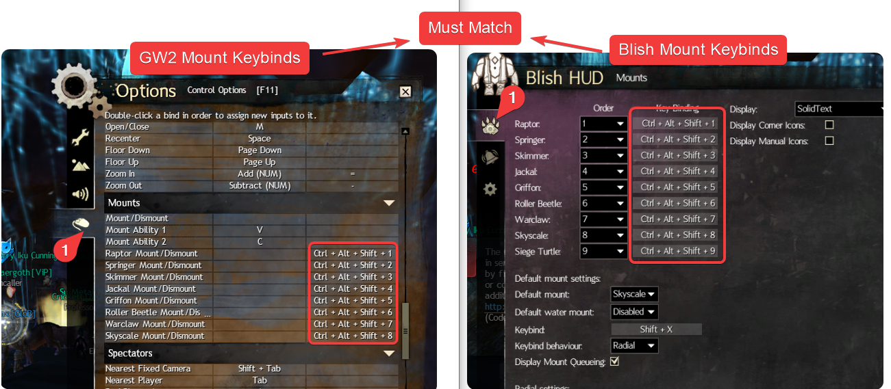

Add several display options related to mounts:
- Mount icons, including in the corner bar and square icons that can be manually placed. You mount on the clicked upon mount.

## Settings

Keybinds:

## Credits
- Ghost for the transparant mount art for Raptor, Springer, Skimmer, Jackal, Griffon, Roller Beetle, Skyscale and Warclaw (taken from https://github.com/Friendly0Fire/GW2Radial/blob/master/readme.md with FriendlyFire's permission.)
- Vixen for the transparant mount art for Siege Turtle.