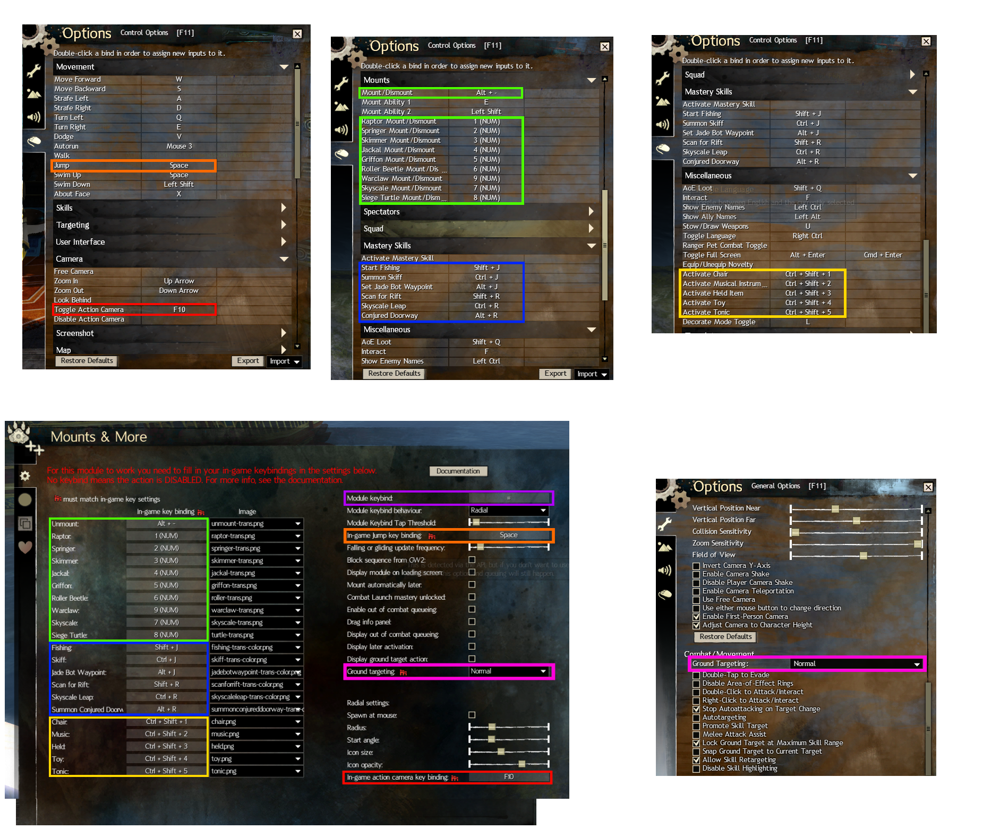
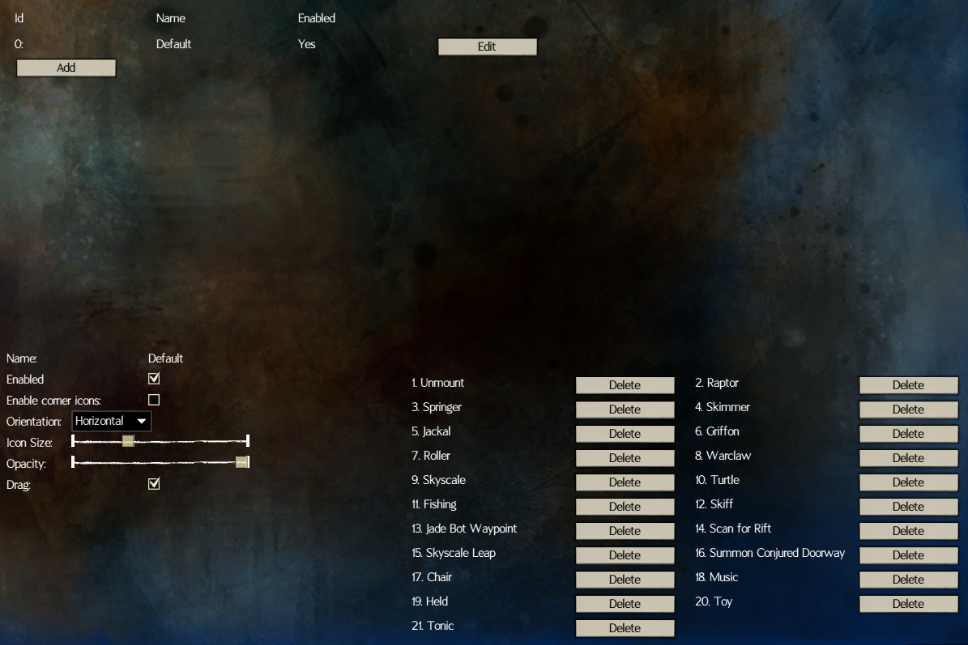

Adds mounts, mastery skills and novelty icons in the form of radial, icon rows and corner icons.

Custom icons, out of combat queueing and automatically loading after map change (mounts only).

[Settings](#settings) need to be configured before using the module!

## Settings

1. Enable the module
  
1. Go to settings
  

### General Settings (1st tab)
On the left you'll see a list of actions with their keybinds and icons.

#### Keybinds

The keybinds in the module need to match the ones in you in-game settings:

1. **Match the keybinds to the game settings** and configure the `module keybind` (purple)
  
  The game and the module might display different values for the keybinds due to your keyboard layout, especially for QWERTY vs AZERTY etc.
1. When you are just standing on the ground, not in water, etc you should see this result when you hold down the keybind.
  

##### Custom icons
To use custom icons:
- Open the designated folder:
  
- Add your new icons, name them like the existing icons `raptor-something-new.png`. Do not replace files, use new filenames or your icons will be replaced.
- Restart the module by disabling and enabling it (see screenshot step 1)

On the right you'll see a list of settings:

#### The `module keybind`
- The keybind itself
- `module keybind` behaviour
  - `radial` (see [radial-settings](#radial-settings)
  - `default` always use the same action.

#### Display the module on the loading screen
Either display or not display the module on the loading screen.

#### Mount automatically on the same mount when using a loading screen.
Keep track of which character is mounted on which mount and re-apply this afterwards. Only applicable on mounts, since for other things we cannot determine if it's in use via the API.

#### Out of Combat queuing
When using an mount that cannot be used in combat we automatically queuing this action when out of combat.

Settings related to out of combat queueing:
  - enable
  - display a spinner when active
  - positioning the spinner on the screen
  - Combat Launch mastery unlocked

The following actions are usable in-game when in combat:
- [Skyscale](https://wiki.guildwars2.com/wiki/Skyscale_(skill)) or [Skyscale mastery](https://wiki.guildwars2.com/wiki/Skyscale_(mastery_skill)) when the  [Combat Launch Mastery](https://wiki.guildwars2.com/wiki/Combat_Launch) is unlocked
- Unmount

##### Combat Launch
Currently it's not possible to detect this via the API, see these issues for more information:
  - https://github.com/gw2-api/issues/issues/31
  - https://github.com/gw2-api/issues/issues/32

The "Combat Launch mastery unlocked" setting was added to mimick this.

#### General Radial Settings
These radial settings are globally applied and should be self explanatory:
- Spawn at mouse (either at mouse position or the center of the screen)
- Radius of the radial
- Start angle of the first thing/action in the list
- Icon size
- Icon opacity
- Action camera keybinding (used to toggle action camera, radial doesn't function well in action camera)

### Custom Radial Settings (2nd tab)
Custom radial settings come in two forms:
- contextual radial settings
- user-defined radial settings

#### Contextual Radial Settings

Module versions up until v1.3.3 contained hard coded logic for automatic dismounting, default water mount, default flying mount, default WvW mount, etc.

Later versions got rid of this since the logic became too complex to maintain. Now this logic is configurable by the end user in the form of so-called radials settings (or contexts if you will).

In above picture we see all states the player character can be in:
- mounted
- in WvW map
- gliding, falling (basically flying/in the air)
- under water
- on water surface
- in combat
- default

These contexts are evaluated according to the evalation order from lowest to highest, first the one with 0, then 1, etc till 99.
This is done because there might be overlap in these states e.g.: a player can both be underwater and mounted.
Only 1 radial/context can be active at the same time.
Being mounted takes precedence in-game so we need to take of that first.

The last radial setting/context is the default, this one is always active and is used as a fallback.

Which radial settings/context is active is a bit hidden for the end user, but should generally work fine, if you want more information on this enabling [additional debug data will help](#debugging-option-and-logging).

The underwater radial settings/context currently does not support SotO under water areas.

Per radial settings/context we have the following options:

##### Enabled
The settings/context is ignored when not enabled.

##### Apply instantly if single
When there is only 1 action configured in a radial/context and this option is checked we do not display the radial, but we perform the action immediately instead.
Remember the "hard coded logic" we talked about earlier in the section, this is the replacement of this.

##### Default action
This action is chosen when
- you selected "Default" as `module keybind` behaviour
- dragging the mouse via right click drag (the mouse being hidden conflicts with action cam detection)

##### Center action
- Center: Which action is displayed in the middle of the radial.
- Remove center from radial: remove the center action from the radial ring when selected.

##### List of actions
The list of actions that are used in this radial settings/context.

❗ If there are actions in the list that do not have a keybind set in the general settings then they will be displayed in red.

#### User-defined Radial Settings

Users are able to define their own radial settings which are not dependent on the context their character is in.

This allows for the creation of seperate sets of things/actions displayed in their own radial.

These user-defined radial settings each should have their own unique non-overlapping keybind. (e.g. not use "B" for 1 keybind and Shift+B for the other, for more info see: https://github.com/blish-hud/Blish-HUD/issues/862)

### Icon Settings (3rd tab)
Icon settings provide rows of actions that are always on the screen.

Up to 5 icon settings can be created.
The default icon settings cannot be removed, they can however be disabled.

Per icon settings we have the following options:
#### Name
Only changeable in icon settings other than the default one.

#### Enabled
Not rendered otherwise.

#### Enable corner icons
Use these actions also for corner icons, only available on the default icon settings.

#### Orientation
Display the row horizontally or vertically.

#### Opacity
The opacity of the displayed icons.

#### Drag
Option to reposition the icons.

#### List of actions
The list of actions that are used in this icon settings.

❗ If there are actions in the list that do not have a keybind set in the general settings then they will be displayed in red.

## Debugging option, logging and reporting issues
Before reproducing an issue, please do the following steps:
- make a screenshot of the relevant module settings and in game settings
- turn on "debug logs" and "additional debug data" in BlishHUD (Settings > Overlay settings > "enable debug logging" & "show additional debug data").
  
You'll see extra logging and extra debug output on the screen like so:
  

Then reproduce the issue in as little steps as possible.
- If possible make a video of the reproduction.

Report the issue on [github](https://github.com/bennieboj/BlishHud-Mounts/issues) or post on our [discord](https://discord.gg/jZ37WfsKxR):
- Add the latest log file, screenshots and all other files together with the problem description. Logs can be found at:
- Documents\Guild Wars 2\addons\blishhud\logs (or a similar folder inside your Settings folder when running in portable mode).

## FAQ

### Q: I want to support you
A: I don't expect anything in return, but if you want you can:
- send some gold/items ingame: Bennieboj.2607
- donate via https://ko-fi.com/bennieboj

### Q: Can I configure mouse buttons for keybinds?
A: No, this is a limitation of BlishHUD atm, see [this issue](https://github.com/blish-hud/Blish-HUD/issues/611) for more information.

## Releases

GitHub releases are out of date.
Recent releases moved to in-Blish-HUD repository: https://blishhud.com/docs/user/installing-modules.

## Credits
- [Manlaan](https://github.com/manlaan) for the original implementation with only icons and mounts.
- Ghost for the original transparant mount art for Raptor, Springer, Skimmer, Jackal, Griffon, Roller Beetle, Skyscale and Warclaw (taken from https://github.com/Friendly0Fire/GW2Radial/blob/master/readme.md with FriendlyFire's permission.)
- Vixen for the transparant mount art for Siege Turtle.
- maanlichtje for the new transparant mount art, both colored and white with and without outline (see resources folder).
