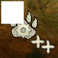
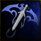
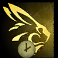
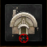
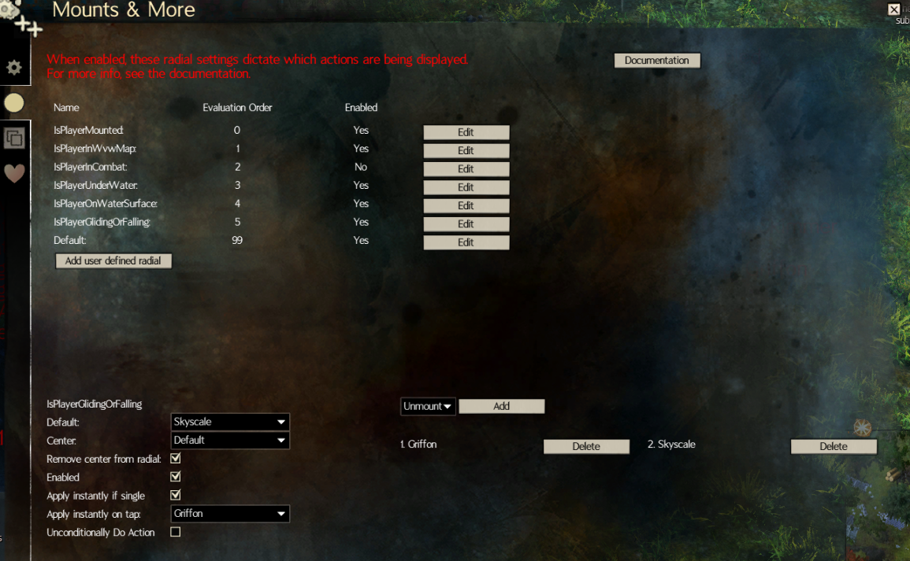

Adds mounts, mastery skills and novelty icons in the form of contextual and user-defined radials, icon rows and corner icons.

Custom icons, out of combat queueing, ground target actions and automatically loading after map change (mounts only).

[Settings](#settings) need to be configured before using the module!

## Settings

1. Enable the module
  
1. Go to settings
  

### General Settings (1st tab)
On the left you'll see a list of actions with their keybinds and icons. 

#### Keybinds

The keybinds in the module need to match the ones in you in-game settings:

1. **Match the keybinds to the game settings** and configure the `module keybind` (purple)
  
  The game and the module might display different values for the keybinds due to your keyboard layout, especially for QWERTY vs AZERTY etc. Each keybind should have their own unique key.
1. When you are just standing on the ground, not in water, etc you should see this result when you hold down the keybind.
  

##### Custom icons
To use your own custom icons, follow these steps:
1. Open the designated folder:
  
1. Add your new icons, name them like the existing icons `raptor-something-new.png`.
   - Do not replace files! Use new filenames, otherwise your icons will be replaced.
1. Restart the module by disabling and enabling it (see screenshot step 1)

Only files with the extension "png" are supported.

On the right you'll see a list of settings:

#### The `module keybind`
- The keybind itself
  - Sending to GW2 is [configurable](#block-sequence-from-gw2).
- `module keybind` behaviour
  - `radial` (see [radial-settings](#radial-settings-2nd-tab))
  - `default` always use the same action, no radial.

#### Tap Threshold
The threshold to determine whether a [module keybind](#the-module-keybind) press (press and release) is a "tap" (in milliseconds, 1000 milliseconds is 1 second). Used in ["Apply instantly on tap"](#apply-instantly-on-tap). Set to 0 to completely disable taps.

#### The jump keybind
- Used to detect if the player is gliding in [the IsPlayerGlidingOrFalling radial context](#gliding-and-falling-detection).
  - This must match the in-game keybind as described in [keybinds](#keybinds)
  - Not taken into account when using this key whilst on a mount.

#### Falling or gliding update frequency
- Used to smoothen the input coming from mumble for [the IsPlayerGlidingOrFalling radial context](#gliding-and-falling-detection).
  - Default 0.1.
  - Lower: faster reaction, but might cause flickering depending on framerate etc.
  - Higher: less flickering, but slower change of state (to and from IsPlayerGlidingOrFalling).

#### Block sequence from GW2
When checked, the sequence is not sent to GW2 otherwise it is sent to GW2.

#### Display the module on the loading screen
Either display or not display the module on the loading screen.

#### Mount automatically after loading screen
Activate later feature.
This feature keeps track of which character is mounted on which mount and re-applies this after the loading screen.
Only applicable on mounts, since for other actions we cannot determine if it's in use via the API.
This is also used when you choose a mount action during a loading screen.

When active it's displayed in the [Info panel](#info-panel).

#### Out of Combat queuing
When using an mount that cannot be used in combat we automatically queuing this action when out of combat.
This feature is disabled in competitive game modes.

Settings related to out of combat queueing:
  - Combat Launch mastery unlocked
  - enable out of Combat queuing
  - display out of combat queuing when active in the [Info panel](#info-panel)

The following actions are usable in-game when in combat:
- For both [Skyscale](https://wiki.guildwars2.com/wiki/Skyscale_(skill)) and [Skyscale mastery](https://wiki.guildwars2.com/wiki/Skyscale_(mastery_skill))
  - Either one of these two need to be set:
    - [Combat Launch Mastery](https://wiki.guildwars2.com/wiki/Combat_Launch) unlocked, this requires an API key and the "progression" permission enabled.
    - "Combat Launch mastery unlocked" option in the module enabled
  - When the API call fails, the "Combat Launch mastery unlocked" option takes over.
  - It is not possible to read in-game cooldowns via mumble, so the module does not know when the [Skyscale mastery](https://wiki.guildwars2.com/wiki/Skyscale_(mastery_skill)) skill is off cooldown.
  - The game launches you in the air for both these skills when you're in combat, see "Mechanics": [Skyscale mastery](https://wiki.guildwars2.com/wiki/Skyscale_(mastery_skill)).
  - If you don't want to use this combat launch mastery for skyscale you can disable the "Combat Launch mastery unlocked" option. 
- Unmount
- Warclaw (since the Janthir Wilds expansion)

#### Info panel
Since version 1.5.0 the out of combat queuing display has been changed into the info panel.

It supports the following features:

| Feature                                                                                | Image                                             |
|----------------------------------------------------------------------------------------|---------------------------------------------------|
| Positioning the info panel on the screen                                               |                |
| [Out of combat queuing](#out-of-combat-queuing)                                        |                |
| [Mount automatically after loading screen](#mount-automatically-after-loading-screen)  |      |
| [Ground target action](#ground-target-actions)                                         |           |

#### General Radial Settings
These radial settings are globally applied and should be self explanatory:
- Spawn at mouse (either at mouse position or the center of the screen)
- Radius of the radial
- Start angle of the first action in the list
- Icon size
- Icon opacity
- Action camera keybinding
  - Used to toggle action camera, radial doesn't function well in action camera
  - This must match the in-game keybind as described in [keybinds](#keybinds)

#### Ground target actions
In-game some actions are [ground-targetable](https://wiki.guildwars2.com/wiki/Targeting#Ground_targeting), like [Skiff](https://wiki.guildwars2.com/wiki/Summon_Skiff) and [Summon Conjured Doorway](https://wiki.guildwars2.com/wiki/Summon_Conjured_Doorway).

When such an action is cast using a mouse action in the module via a radial or icons, it usually ends up in the wrong place.

Since version 1.5.0 the module now handles ground target actions differently when you use them via a radial or icons depending on the `Ground targeting option`:
- Normal: Show range indicator on first press, cast on second.
- Fast with range indicator - Show range indicator on keypress, cast on release.
- Instant - Keeps track of your action and instantly casts at your mouse cursor's location on the next click of the left mouse button.
  - When active it's displayed in the [Info panel](#info-panel).

❗ Make sure the Ground targeting option matches the one in your in-game settings.

### Radial Settings (2nd tab)
Custom radial settings come in two forms:
- contextual radial settings
- user-defined radial settings

Some settings are common for both contextual- and user-defined radial settings:

#### Enabled
The settings/context is ignored when not enabled.

#### Default action
This action is chosen when
- you selected "Default" as `module keybind` behaviour
- dragging the mouse via right click drag (the mouse being hidden conflicts with action cam detection)

#### Center action
- Center: Which action is displayed in the middle of the radial, either Default (see 1 item higher) or LastUsed.
- Remove center from radial: removes the center action from the radial ring when selected.

#### List of actions
The list of actions that are used in this radial settings/context.

❗ If there are actions in the list that do not have a keybind set in the general settings then they will be displayed in red.

#### Contextual Radial Settings
Module versions up until v1.3.3 contained hard coded logic for automatic dismounting, default water mount, default flying mount, default WvW mount, etc.

Later versions got rid of this since the logic became too complex to maintain. Now this logic is configurable by the end user in the form of so-called radials settings (or contexts if you will).

In above picture we see all states the player character can be in:
- mounted
- in combat
- in WvW map
- gliding, falling (basically flying/in the air)
- under water
- on water surface
- default

These contexts are evaluated according to the evalation order from lowest to highest, first the one with 0, then 1, etc till 99.
This is done because there might be overlap in these states e.g.: a player can both be underwater and mounted.
Only 1 radial/context can be active at the same time.
Being mounted takes precedence in-game so we need to take care of that first.

The last radial setting/context is the default, this one is always active and is used as a fallback.

Which radial settings/context is active is a bit hidden for the end user, but should generally work fine, if you want more information on this enabling [additional debug data will help](#debugging-option-and-logging).

##### Underwater in SotO maps
Normally all water is at the same level (z = 0).
The underwater radial settings/context currently does support SotO under water areas thanks to [TinyTaimi from the UndaDaSea module](https://github.com/OpNop/UndaDaSea-BlishHUD) and Teh from the BlishHUD discord.

##### Gliding and falling detection
Gliding and falling is detected by looking at the z values of the player character and calculating the velocity of that movement.
Gliding only happens downwards and flying can happen both up and downwards (e.g. being catapulted by dismounting, jumping into the air).

Initially there was only 1 threshold for both gliding and falling, but this caused false positives when walking up and down sloped surfaces.

Since version 1.4.2 the threshold for falling has been increased to avoid false positives.
The threshold for gliding has lowered for better detection and an extra input (based on [the jump keybind](#the-jump-keybind)) has been added to avoid triggering when walking on sloped surfaces.

##### Unmounting since 1.4.0
In version 1.3.3 we handled unmounting in the following way:

 - We detect if the player is mounted (this is hard coded).
 - We dismount using the action of the active mount.

In version 1.4.0 we handle unmounting in the following way:

 - We configure which mounts you want to see in the radial when using the IsPlayerMounted radial setting. 
 - If you select multiple actions then you will see these in the radial when mounted. 
 - If you select only 1 action and select "Apply Instantly if single" then we immediately do the single action.
 - The mount/dismount keybind is used to also unmount from chairs, etc.
 - You can dismount using the mount/dismount action.
 - By default from versions 1.4.0 till 1.4.7 the following is migrated: IsPlayerMounted enabled, unmount added. The only thing you need to do is to set the dismount keybind.
 - If you don't want to use the dismount action in the IsPlayerMounted radial settings, please replace it with a mount (e.g.: raptor) and enable [Unconditionally Do Action](#unconditionally-do-action)).
   - By default from versions 1.4.8 onwards the following is migrated: IsPlayerMounted enabled, Raptor added and "Unconditionally Do Action" set to true for IsPlayerMounted. No keybind additions are required. This puts this functionality more in line with how it was in 1.3.3.
 
Per radial settings/context we have the following options:

##### Apply instantly if single
When there is only 1 action configured in a radial context and this option is checked we do not display the radial, but we perform the action immediately instead.
Remember the "hard coded logic" we talked about earlier in the section, this is the replacement of this.

##### Apply instantly on tap
Version 1.5.0 of the module introduces the concept of tapping the module keybind.
This is only applicable to the module keybind, e.g. for contextual radial settings, **not for user-defined radial settings**.

A tap is defined by the user pressing the module keybind and releasing it within the [Tap Threshold](#tap-threshold).
When the threshold is exceeded the normal logic kicks in even if the user is still holding the module keybind.

The normal logic is the following:
1. check "Apply instantly if single"
1. default action in case of mouse dragging (see [default action](#default-action))
1. do default action or display radial (see [default action](#default-action))

This allows the user to instantly trigger 1 action per contextual radial settings whilst still keeping the existing radial (when Apply instantly if single is disabled).

The selected action in "Apply instantly on tap" is removed from the logic once the user exceeds the tap threshold.
This allows "Apply instantly on tap" to work together with "Apply instantly if single" (if enabled).
Meaning that if the user held the module keybind too long the tap action is removed from the possible options.
If after the removal there is only 1 action left in the context Apply instantly if single will trigger, see example below.

In the screenshot below the user has configured the following:
- 2 actions: Griffon and Skyscale
- "Apply instantly if single" enabled
- "Apply instantly on tap": Griffon

When the radial context is active this allows the user to tap the module keybind to use griffon.
When the user holds the module keybind. The "Apply instantly on tap" action is removed from radial which only leavee skyscale is the only left over action and .

##### Unconditionally Do Action
Used to disable [out of combat queuing](#out-of-combat-queuing), [LastUsed](#center-action) and [mount automatically after loading screen](#mount-automatically-after-loading-screen).
Only useful when the user has configured a mount action (e.g.: Raptor) instead of the dismount action to dismount in the IsPlayerMounted contextual radial settings.

#### User-defined Radial Settings

Users are able to define their own radial settings which are not dependent on the context their character is in.

This allows for the creation of seperate sets of actions displayed in their own radial.

Sending to GW2 is [configurable](#block-sequence-from-gw2).

These user-defined radial settings each should have their own unique keybind.

### Icon Settings (3rd tab)
Icon settings provide rows of actions that are always on the screen.

Up to 5 icon settings can be created.
The default icon settings cannot be removed, they can however be disabled.

Per icon settings we have the following options:
#### Name
Only changeable in icon settings other than the default one.

#### Enabled
Not rendered otherwise.

#### Enable corner icons
Use these actions also for corner icons, only available on the default icon settings.

#### Enabled in competitive maps
Enable/disabled in WvW.

#### Orientation
The orientation of the icon row, either horizontal or vertical.

#### Icon Size
The icon size of actions in the row.

#### Opacity
The opacity of actions in the row.

#### Drag
Option to enable repositioning the icon row using the white icon at the beginning of the row.

#### List of actions
The list of actions that are used in this icon settings.

❗ If there are actions in the list that do not have a keybind set in the general settings then they will be displayed in red.

## Debugging option, logging and reporting issues
Before reproducing an issue, please do the following steps:
- make a screenshot of the relevant module settings and in game settings
- turn on "debug logs" and "additional debug data" in BlishHUD (Settings > Overlay settings > "enable debug logging" & "show additional debug data").
  
You'll see extra logging and extra debug output on the screen like so:
  

Then reproduce the issue in as little steps as possible.
- If possible make a video of the reproduction.

Report the issue on [github](https://github.com/bennieboj/BlishHud-Mounts/issues) or post on our [discord](https://discord.gg/jZ37WfsKxR):
- Add the latest log file, screenshots and all other files together with the problem description. Logs can be found at:
- Documents\Guild Wars 2\addons\blishhud\logs (or a similar folder inside your Settings folder when running in portable mode).

## FAQ

### Q: I want to support you
A: I don't expect anything in return, but if you want you can:
- send some gold/items ingame: Bennieboj.2607
- donate via https://ko-fi.com/bennieboj

### Q: Can I configure mouse buttons for keybinds?
A: Not directly, but read on:
- This is a limitation of BlishHUD atm, see [this issue](https://github.com/blish-hud/Blish-HUD/issues/611) for more information.
- The best way of using mouse buttons is to map the mouse buttons to keyboard keys (e.g.: PageDown) and then use these keyboard keys in-game. The mapping most likely needs to be done in the software of your mouse or using a tool like [AHK](https://www.autohotkey.com/). This has the added advantage that it works for all use cases since not all mouse buttons are even detected by your OS/GW2 by default (typically mouse 6 and up are not detected).

## Releases

GitHub releases are out of date.
Recent releases moved to in-Blish-HUD repository: https://blishhud.com/docs/user/installing-modules.

## Credits
Code:
- [Manlaan](https://github.com/manlaan) for the original implementation with only icons and mounts.

Art resources (see resources/user-provided folder):
- Ghost for the original transparant mount art for Raptor, Springer, Skimmer, Jackal, Griffon, Roller Beetle, Skyscale and Warclaw (taken from https://github.com/Friendly0Fire/GW2Radial/blob/master/readme.md with FriendlyFire's permission.)
- Vixen for the transparant mount art for Siege Turtle.
- maanlichtje for the transparant mount art, both colored and white with and without outline.
- dingus179 for the transparant mastery and novelty icons
- rodentmastermind for making the transparant icons more consistent
